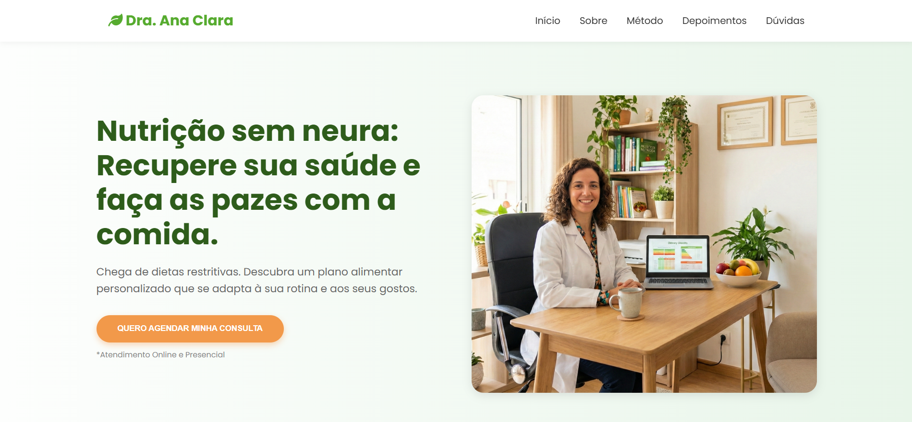

# Landing Page para Nutricionista (Template)




> Uma landing page de alta conversão, moderna e responsiva, desenvolvida para uma nutricionista com foco em nutrição comportamental.

---

## 📋 Sobre o Projeto

Este projeto é uma Landing Page estática desenvolvida para a persona "Dra. Ana Clara", uma nutricionista focada em reeducação alimentar sem dietas restritivas.

O objetivo principal da página é gerar **autoridade**, criar **conexão** com as dores do potencial paciente e, finalmente, converter o visitante em um agendamento de consulta através de um **link direto para o WhatsApp**.

A estrutura foi pensada estrategicamente com técnicas de copywriting e design voltado para conversão.

## ✨ Funcionalidades e Destaques

* **Design Responsivo:** Layout se adapta perfeitamente a desktops, tablets e smartphones (Mobile-First).
* **Integração com WhatsApp:** Botões de CTA (Call to Action) com redirecionamento direto para a API do WhatsApp com um número centralizado.
* **CSS Moderno:** Utilização de CSS Grid, Flexbox e Variáveis CSS (Custom Properties) para fácil manutenção e alteração de tema.
* **Navegação Suave:** Menu com "Smooth Scroll" para as seções da página.
* **Menu Mobile Interativo:** Menu "hambúrguer" funcional para dispositivos móveis.
* **FAQ Interativo:** Seção de Perguntas Frequentes com estilo "acordeão" (abre e fecha).
* **Semântica HTML5:** Estrutura otimizada para SEO básico.

## 🛠️ Tecnologias Utilizadas

O projeto foi construído utilizando apenas tecnologias nativas da web, sem dependência de frameworks pesados.

* [HTML5](https://developer.mozilla.org/pt-BR/docs/Web/HTML) - Estrutura semântica.
* [CSS3](https://developer.mozilla.org/pt-BR/docs/Web/CSS) - Estilização e layout.
* [JavaScript (Vanilla)](https://developer.mozilla.org/pt-BR/docs/Web/JavaScript) - Interatividade (menu, FAQ, redirecionamentos).
* [Font Awesome 6](https://fontawesome.com/) - Ícones.
* [Google Fonts](https://fonts.google.com/) - Tipografia (Fonte "Poppins").

## 🚀 Como Rodar o Projeto Localmente

Por ser um projeto estático, é muito simples de executar:

1.  **Clone o repositório:**
    ```bash
    git clone [https://github.com/SEU-USUARIO/NOME-DO-REPOSITORIO.git](https://github.com/SEU-USUARIO/NOME-DO-REPOSITORIO.git)
    ```
2.  **Acesse a pasta:**
    ```bash
    cd NOME-DO-REPOSITORIO
    ```
3.  **Abra o arquivo principal:**
    Basta dar um duplo clique no arquivo `index.html` para abri-lo no seu navegador padrão.

## ⚙️ Personalização (Como usar para você)

Este template é facilmente adaptável. Veja onde alterar os principais pontos:

### 1. Mudar o Número do WhatsApp
Acesse o arquivo `js/script.js` e altere a variável `myNumber` na linha indicada. Todos os botões do site serão atualizados automaticamente.

```javascript
// js/script.js
const myNumber = "5511999999999"; // <-- Coloque seu número aqui (apenas dígitos)
